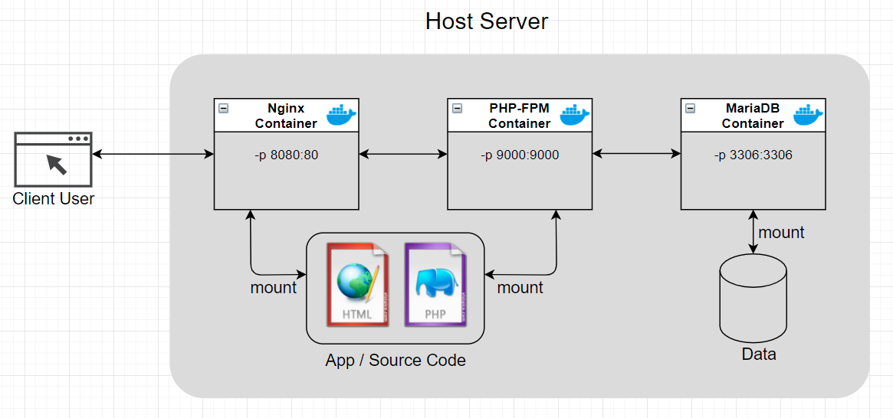
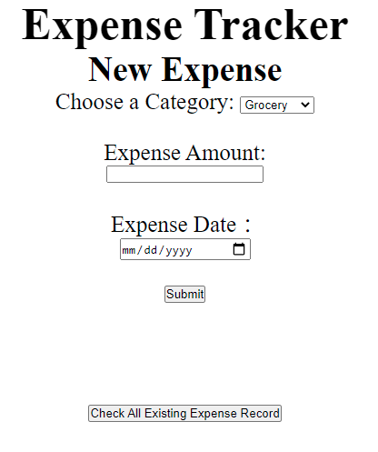

# Expense Tracker Web App

## Project Introduction

This web app helps user to record and keep track of daily expenses. It is implemented via three docker containers, then through docker-compose to form a LNMP(Linux, Nginx, MySQL/MariaDB, PHP) environment. The whole setup can be used to host various other web apps which requires LNMP environment. 

## Structure Diagram



## Detailed Design

1. Nginx handles the client request and make appropriate response through exposed port 8080.
2. PHP-FPM is the middleware that receive actions from front-end Nginx to perform data entry and data query to back-end database MariaDB.
3. Both Nginx and PHP-FPM container are mounted to source code directory on the hose machine, so that Nginx can handle the static contents such as html files, while PHP-FPM will handle the dynamic contents - php scripts; also developer can access and test the source code without going into each container. 
4. MariaDB will store the data and mount the data content in the host machine.

## Installation Instruction

1. create a new project directory 

2. `git clone` the repo into the above directory

3. install docker and docker-compose

4. make sure firewalld allows port 8080 and 3306

5. In the project directory, simply run command:

   ```shell
   $ sudo docker-compose up
   ```

## Access

​	Access the web app by opening a web browser and type in the url `http://<server-ip>:8080` 

​	

## Update

July 1, 2021 - upgrade php from version 5.4 to 7.4, and associated php scripts to accommodate php 7.4 to mysql connection changes.
